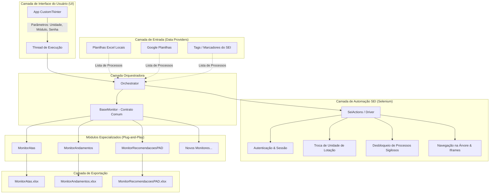

# Documentação Técnica e Arquitetura do Sistema: Monitor SEI

> **Versão do Documento:** 1.0.0  
> **Data:** 18 de setembro de 2026  
> **Status:** Especificação Arquitetural e Funcional  
> **Repositório:** `monitor_SEI`  

---

## 1. Visão Geral do Projeto

O **Monitor SEI** é uma solução em Python de Automação Robótica de Processos (RPA) e monitoramento contínuo para o **Sistema Eletrônico de Informações (SEI)**, largamente adotado na administração pública brasileira.

### 1.1 Contexto e Justificativa
Na grande maioria dos órgãos e entidades públicas, os usuários e servidores não dispõem de credenciais de acesso a Web Services / APIs REST abertas do SEI. Por conseguinte, tarefas de acompanhamento processual (tais como verificação de despachos, juntada de atas, monitoramento de prazos em PAD e checagem de andamentos em lote) são realizadas manualmente, exigindo navegação repetitiva entre unidades e processos.

O **Monitor SEI** automatiza essa rotina simulando a interação com o sistema via navegador (Selenium / WebDriver), agregando regras de negócio modulares, suporte a credenciais de processos sigilosos e relatórios exportados automaticamente.

---

## 2. Diagrama de Fluxo e Arquitetura

O sistema adota uma **Arquitetura Modular em Camadas**, onde a lógica de monitoramento é desacoplada da origem dos dados e da interface de apresentação.



---

## 3. Regras de Negócio e Requisitos Funcionais

### RN01 - Seleção de Unidade de Lotação
- O usuário deve escolher na interface visual entre **4 unidades de lotação** pré-configuradas no órgão (`CGUERJ`, `SCGUERJ`, `CINQA`, `COMISTS`).
- **Persistência de Unidade:** A alteração de unidade é feita uma única vez no início do lote via combo de unidades no SEI (`#selInfraUnidades`). Todos os processos do lote são consultados sob a mesma unidade ativa.

### RN02 - Arquitetura de Módulos Dinâmicos (Plug-and-Play)
- Os tipos de monitoramento não devem ser fixos no código principal.
- Cada tipo de monitoramento é uma classe independente que estende a interface abstrata `BaseMonitor`.
- Novos monitores podem ser adicionados à pasta `monitors/` e são detectados dinamicamente pela interface gráfica.
- Exemplos de monitores iniciais:
  1. **Monitoramento de Atas Criadas:** Identifica se foram geradas novas atas ou termos em datas recentes.
  2. **Monitoramento de Andamentos Gerais:** Compara o último registro da tabela de histórico com a execução anterior.
  3. **Monitoramento de Recomendações de PAD:** Analisa despachos e termos em busca de palavras-chave ou decisões sancionadoras/recomendatórias.

### RN03 - Desacoplamento da Origem dos Processos (Fontes de Entrada)
- O módulo de monitoramento deve receber apenas uma lista limpa de números de processo (`list[str]`), sem precisar saber de onde vieram.
- O sistema aceita as seguintes fontes de dados:
  - **Planilha Excel (.xlsx) ou CSV local:** Localizada em diretório físico da máquina ou rede.
  - **Google Planilhas (Google Sheets):** Consulta via API pública/service account lendo uma coluna específica.
  - **Coletor Interno do SEI (Crawler por Marcador):** O robô lista os processos diretamente da tela inicial do SEI com base em marcadores/tags (ex: `secretário: Fulano`) ou tipo de procedimento (ex: `Correição`).

### RN04 - Autenticação Inicial no SEI-RJ e Suporte a Processos Sigilosos
- **Login Inicial no Portal SEI-RJ (SIP):**
  - URL de Acesso: `https://sei.rj.gov.br/sip/login.php?sigla_orgao_sistema=ERJ&sigla_sistema=SEI`
  - A interface gráfica do Monitor SEI disponibiliza os três campos exigidos pelo portal:
    1. **Usuário:** Preenche o elemento `#txtUsuario` com o login de rede/servidor.
    2. **Senha:** Preenche o elemento `#pwdSenha` (com máscara `*`).
    3. **Órgão:** Preenche o elemento `#selOrgao` — no sistema estadual SEI-RJ, a Universidade do Estado do Rio de Janeiro é identificada pelo valor `40` (`UERJ`). A interface gráfica mantém este campo **sempre preenchido com UERJ** de forma padrão e assistida.
  - O robô submete o formulário via botão `#sbmAcessar` (`acaoLogin(2)`).
- **Desbloqueio de Processos Sigilosos:**
  - Ao abrir um processo com restrição de sigilo, o SEI solicita confirmação de credenciais (usuário e senha do operador).
  - O robô detecta dinamicamente a presença da janela ou modal de credencial (`#pwdSenha`, `#txtSenha`), reaproveita as credenciais informadas na interface e confirma o acesso automaticamente.
  - **Segurança e Prevenção de Bloqueio:** O robô monitora mensagens de erro de autenticação; caso a senha falhe, o lote é interrompido imediatamente para impedir o bloqueio da conta do usuário no sistema do órgão (máximo de 2 tentativas).

### RN05 - Convenção de Nomenclatura na Exportação (Convention over Configuration)
- Os dados extraídos devem ser exportados automaticamente para planilhas dedicadas.
- **Regra do Nome:** O nome do arquivo gerado (ou da aba correspondente) é **obrigatoriamente idêntico ao identificador do módulo executado**:
  - `MonitoramentoAtasFeitas` $\rightarrow$ `MonitoramentoAtasFeitas.xlsx` (Colunas: *Número do Processo*, *Data da Primeira Assinatura*, *Número da Ata*, *Secretário*)
  - `MonitorAndamentos` $\rightarrow$ `MonitorAndamentos.xlsx`
  - `MonitorAtas` $\rightarrow$ `MonitorAtas.xlsx`
  - `MonitorRecomendacoesPAD` $\rightarrow$ `MonitorRecomendacoesPAD.xlsx`
- O exportador suporta modo de atualização incremental (*append* de novos eventos e *update* de status) preservando o histórico existente.

### RN06 - Resiliência e Tolerância a Falhas Individuais
- Caso um processo específico da lista não seja localizado, apresente erro de permissão ou falha de timeout, o robô **não aborta a execução do lote todo**.
- O incidente é registrado no log em tempo real e gravado com status de pendência no relatório final, prosseguindo para o próximo processo.

---

## 4. Engenharia Reversa e Mapeamento do DOM do SEI

A interface do SEI possui características particulares que exigem tratamento rigoroso de seletores e contextos de janelas e *iframes*.

### 4.1 Principais Elementos do SEI-RJ (SIP / SEI)

| Elemento Funcional | Seletor Típico (ID / XPath / CSS) | Finalidade |
| :--- | :--- | :--- |
| **Campo de Usuário (Login Inicial)** | `input#txtUsuario` | Identificação do login do servidor no formulário de autenticação do SEI-RJ. |
| **Campo de Senha (Login Inicial)** | `input#pwdSenha` | Senha de acesso do usuário. |
| **Seletor de Órgão (Login Inicial)** | `select#selOrgao` | Dropdown do órgão de lotação — sempre preenchido com **`UERJ`** (value `40`). |
| **Botão Acessar (Login Inicial)** | `button#sbmAcessar` | Dispara o envio das credenciais e submissão do formulário de login. |
| **Combo de Unidades** | `select#selInfraUnidades` | Alternar a lotação ativa do usuário no cabeçalho superior (`CGUERJ`, `SCGUERJ`, `CINQA`, `COMISTS`). |
| **Campo de Pesquisa Rápida** | `input#txtPesquisaRapida` | Caixa de texto global para digitar o número do processo. |
| **Botão de Pesquisa Rápida** | `button#btnPesquisaRapida` ou `img[name='btnPesquisaRapida']` | Dispara a busca direta do processo. |
| **Campo de Senha (Sigiloso)** | `input#pwdSenha` / `input#txtSenha` / `//input[@type='password']` | Autenticação no pop-up de processo sigiloso. |
| **Campo de Usuário (Sigiloso)** | `input#txtUsuario` / `input#txtLogin` | Identificação do usuário na janela de sigilo (se exigido). |
| **Botão de Confirmação (Sigiloso)** | `button#sbmAcessar` / `button#btnConfirmar` | Confirma as credenciais do processo sigiloso. |
| **Nós da Árvore de Documentos** | `a.infraArvoreNo, span.infraArvoreNo` | Lista de documentos, despachos e termos anexados ao processo. |
| **Botão Consultar Andamento** | `//a[contains(@href, 'andamento_consultar') or @title='Consultar Andamento']` | Abre o histórico formal de tramitação do processo. |
| **Tabela de Histórico** | `table.infraTable, table#tblHistorico` | Tabela contendo data/hora, unidade e descrição do andamento. |

---

### 4.2 Arquitetura de Iframes e Mapa Mental de Contexto

O SEI organiza a tela de visualização do processo através de quadros aninhados (*nested iframes*). O script deve navegar estritamente respeitando a hierarquia de contextos para evitar erros de `NoSuchFrameException`.

```plaintext
[ default_content ] (Página raiz / barra de pesquisa rápida / cabeçalho de unidades)
       │
       ▼
   switch_to.frame("ifrVisualizacao")          <-- Frame Pai do Processo
       ├──► switch_to.frame("ifrArvore")       <-- Frame da Árvore (Lado Esquerdo)
       │           │
       │           ├─ Extrair nomes e tipos dos documentos anexados
       │           └─ Clicar no botão 'Consultar Andamento'
       │           │
       │           ▼
       │     switch_to.parent_frame()          <-- Retorna ao ifrVisualizacao (OBRIGATÓRIO)
       │           │
       └──► switch_to.frame("ifrConteudoVisualizacao") <-- Frame de Conteúdo (Lado Direito)
                   │
                   ├─ Aguardar carregamento da tabela (.infraTable)
                   └─ Extrair última linha de histórico / andamento
                   │
                   ▼
             switch_to.default_content()       <-- Retorna à raiz para o próximo processo
```

> [!IMPORTANT]
> **Atenção ao alternar entre Árvore e Conteúdo:**  
> `ifrArvore` e `ifrConteudoVisualizacao` são nós-irmãos dentro de `ifrVisualizacao`. Não é possível alternar diretamente entre eles. É obrigatório executar `driver.switch_to.parent_frame()` antes de entrar no outro frame.

---

## 5. Estrutura de Diretórios Recomendada

```plaintext
monitor_SEI/
│
├── README.md                          # Visão geral rápida e instruções de uso
├── requirements.txt                   # Dependências do projeto (selenium, customtkinter, etc.)
│
├── docs/
│   ├── CONVERSA_TRANSCRICAO.md        # Transcrição integral da conversa do Gemini
│   └── DOCUMENTACAO_MONITOR_SEI.md    # Este documento arquitetural
│
├── config/
│   ├── __init__.py
│   └── settings.py                    # Unidades, URLs base do SEI, timeouts e constantes
│
├── core/
│   ├── __init__.py
│   ├── base_monitor.py                # Classe abstrata e contrato BaseMonitor
│   └── orchestrator.py                # Gerenciador da esteira de execução
│
├── rpa_sei/
│   ├── __init__.py
│   ├── driver_manager.py              # Inicialização do WebDriver (Edge/Chrome, headless, perfil)
│   ├── auth.py                        # Lógica de login e desbloqueio de processos sigilosos
│   └── sei_navigator.py               # Ações no SEI (troca de unidade, busca rápida, frames)
│
├── inputs/
│   ├── __init__.py
│   ├── base_reader.py                 # Interface para leitura de processos
│   ├── excel_reader.py                # Leitura de planilhas locais (.xlsx, .csv)
│   ├── gsheets_reader.py              # Integração com API do Google Planilhas
│   └── sei_crawler.py                 # Coleta de processos por tags/marcadores no próprio SEI
│
├── monitors/                          # Diretório Plug-and-Play de novos monitores
│   ├── __init__.py
│   ├── monitor_atas_feitas.py         # Monitor especializado: atas feitas com filtro por maior ata e 1ª assinatura
│   ├── monitor_andamentos.py          # Monitor de histórico e tramitações gerais
│   └── monitor_atas.py                # Monitor genérico de detecção de atas
│
├── exporters/
│   ├── __init__.py
│   ├── base_exporter.py               # Interface de exportação
│   ├── excel_exporter.py              # Gravação em .xlsx com nome do módulo
│   └── gsheets_exporter.py            # Gravação em aba do Google Sheets
│
├── ui/
│   ├── __init__.py
│   └── app.py                         # Interface gráfica CustomTkinter com suporte a Threads
│
└── main.py                            # Ponto de entrada da aplicação
```

---

## 6. Especificação dos Componentes de Código

### 6.1 Contrato Base (`core/base_monitor.py`)

Todo novo módulo de monitoramento implementa este contrato abstrato:

```python
from abc import ABC, abstractmethod
from typing import Any

class BaseMonitor(ABC):
    """
    Contrato base para criação de novos módulos de monitoramento no SEI.
    Qualquer nova funcionalidade deve herdar desta classe.
    """

    @property
    @abstractmethod
    def nome_identificador(self) -> str:
        """Retorna o identificador do módulo (ex: 'MonitorAtas'). Usado para nomear o arquivo de saída."""
        pass

    @property
    @abstractmethod
    def descricao(self) -> str:
        """Descrição legível exibida no combo da interface gráfica."""
        pass

    @abstractmethod
    def carregar_alvos(self, fonte_params: dict) -> list[str]:
        """
        Carrega a lista de números de processos a serem inspecionados.
        Pode obter de arquivo local, Google Sheets ou crawler do SEI.
        """
        pass

    @abstractmethod
    def inspecionar_processo(self, driver: Any, numero_processo: str) -> dict:
        """
        Lógica específica de inspeção dentro dos iframes do SEI para o processo.
        Retorna dicionário com os dados coletados.
        """
        pass

    @abstractmethod
    def estruturar_linhas_exportacao(self, resultados: list[dict]) -> list[dict]:
        """
        Padroniza os dados coletados em linhas tabulares prontas para exportação.
        """
        pass
```

---

### 6.2 Módulo de Interface com o Usuário (`ui/app.py`)

A interface gráfica foi desenhada em **CustomTkinter** com tema moderno (*Dark/Light* nativo) e execução da automação em *thread* isolada (`threading.Thread`), garantindo responsividade contínua:

```python
import customtkinter as ctk
import threading
import time

ctk.set_appearance_mode("System")
ctk.set_default_color_theme("blue")

class AppMonitorSEI(ctk.CTk):
    def __init__(self, lista_unidades: list[str], modulos_disponiveis: list[dict]):
        super().__init__()

        self.title("Monitor SEI - Painel de Controle")
        self.geometry("540x660")
        self.resizable(False, False)

        self.modulos = modulos_disponiveis

        # 1. Título e Cabeçalho
        self.lbl_titulo = ctk.CTkLabel(
            self, text="Monitoramento Automatizado SEI", 
            font=ctk.CTkFont(size=20, weight="bold")
        )
        self.lbl_titulo.pack(pady=(20, 10))

        # 2. Seletor de Unidades (4 Unidades pré-definidas)
        self.lbl_unidade = ctk.CTkLabel(self, text="Selecione a Unidade de Trabalho:")
        self.lbl_unidade.pack(anchor="w", padx=40, pady=(10, 0))
        
        self.combo_unidade = ctk.CTkComboBox(self, values=lista_unidades, width=460)
        self.combo_unidade.pack(padx=40, pady=(5, 10))

        # 3. Seletor Dinâmico de Tipo de Monitoramento
        self.lbl_modulo = ctk.CTkLabel(self, text="Tipo de Monitoramento:")
        self.lbl_modulo.pack(anchor="w", padx=40, pady=(5, 0))

        nomes_modulos = [m["nome"] for m in self.modulos]
        self.combo_modulo = ctk.CTkComboBox(self, values=nomes_modulos, width=460)
        self.combo_modulo.pack(padx=40, pady=(5, 10))

        # 4. Credenciais de Acesso ao SEI-RJ (Usuário, Senha e Órgão UERJ)
        self.lbl_credenciais = ctk.CTkLabel(self, text="Credenciais de Acesso ao SEI-RJ:")
        self.lbl_credenciais.pack(anchor="w", padx=40, pady=(5, 0))

        # Linha com Usuário e Senha
        self.txt_usuario = ctk.CTkEntry(self, placeholder_text="Usuário (ex: nome.sobrenome)", width=225)
        self.txt_senha = ctk.CTkEntry(self, placeholder_text="Senha de acesso", show="*", width=225)

        # Dropdown de Órgão fixado com UERJ (Código 40 no SEI-RJ)
        self.combo_orgao = ctk.CTkComboBox(self, values=["UERJ"], state="readonly", width=160)
        self.combo_orgao.set("UERJ")

        # 5. Botão de Execução
        self.btn_iniciar = ctk.CTkButton(
            self, text="Iniciar Monitoramento", 
            command=self._iniciar_execucao_thread, 
            height=40, width=460, font=ctk.CTkFont(weight="bold")
        )
        self.btn_iniciar.pack(padx=40, pady=(10, 15))

        # 6. Caixa de Log em Tempo Real
        self.lbl_log = ctk.CTkLabel(self, text="Registro de Execução (Logs):")
        self.lbl_log.pack(anchor="w", padx=40, pady=(5, 0))

        self.caixa_logs = ctk.CTkTextbox(self, width=460, height=200)
        self.caixa_logs.pack(padx=40, pady=(5, 20))

    def adicionar_log(self, mensagem: str):
        """Atualiza a caixa de log na interface gráfica de forma segura."""
        self.caixa_logs.insert("end", f"[{time.strftime('%H:%M:%S')}] {mensagem}\n")
        self.caixa_logs.see("end")

    def _iniciar_execucao_thread(self):
        self.btn_iniciar.configure(state="disabled")
        t = threading.Thread(target=self._executar_esteira, daemon=True)
        t.start()

    def _executar_esteira(self):
        unidade = self.combo_unidade.get()
        modulo_nome = self.combo_modulo.get()
        senha_sigilosos = self.txt_senha.get()

        self.adicionar_log(f"Iniciando rotina para a unidade: {unidade}")
        self.adicionar_log(f"Módulo ativado: {modulo_nome}")
        
        # Aqui o Orchestrator é acionado
        # ...
        
        self.adicionar_log("Processo concluído com sucesso!")
        self.btn_iniciar.configure(state="normal")
```

---

## 7. Boas Práticas de Segurança e Integridade

1. **Proteção de Credenciais:**
   - As senhas nunca devem ser gravadas em arquivos locais em texto claro (`plain text`).
   - O campo na interface utiliza máscara de digitação (`show="*"`).
   - Opcionalmente, pode-se ler de variáveis de ambiente com `os.getenv("SEI_PASSWORD")`.
2. **Prevenção de Bloqueio de Conta (Lockout):**
   - No SEI, tentativas consecutivas com senha inválida bloqueiam o acesso do servidor público.
   - O robô implementa contagem de falha de autenticação: se a confirmação de senha falhar em um processo, a execução é interrompida imediatamente para averiguação pelo usuário humano.
3. **Reutilização de Sessão com Perfis de Navegador:**
   - O Selenium pode ser inicializado utilizando o diretório de dados do usuário (`user-data-dir`).
   - Dessa forma, autenticações de duplo fator (2FA) e Gov.br podem ser realizadas uma única vez manualmente, e o robô reutiliza os cookies ativos sem exigir novas digitações.

---

## 8. Empacotamento e Distribuição (.EXE)

Para distribuir o programa aos servidores e colegas de equipe sem a necessidade de instalar o Python ou configurar variáveis de ambiente, o projeto pode ser empacotado em um executável autônomo com o **PyInstaller**:

```bash
pip install pyinstaller
pyinstaller --noconsole --onefile --add-data "config;config" main.py --name "Monitor_SEI"
```

O binário gerado na pasta `dist/Monitor_SEI.exe` opera de forma portátil, utilizando o navegador Microsoft Edge nativo já presente no Windows.

---

## 9. Roadmap de Implementação

- [x] Extração e transcrição completa dos requisitos e discussões da conversa original.
- [x] Especificação da arquitetura técnica e regras de negócio.
- [x] Implementação do contrato base `core/base_monitor.py` e do orquestrador `core/orchestrator.py`.
- [x] Implementação das rotinas Selenium para navegação em iframes e desbloqueio de sigilosos em `rpa_sei/`.
- [x] Construção do leitor de fontes de entrada em `inputs/` e exportador padronizado em `exporters/`.
- [x] Implementação do módulo piloto `Monitoramento atas feitas` (`MonitorAtasFeitas`):
  - Filtro a partir da maior ata registrada (`max_ata + 1`);
  - Captura mesmo sem assinatura (minuta);
  - Extração da data da primeira assinatura eletrônica;
  - Identificação dinâmica do Secretário(a) e geração de planilha com as 4 colunas solicitadas.
- [x] Interface gráfica desktop moderna com CustomTkinter (`ui/app.py`) e suporte aos 3 campos do SEI-RJ:
  - Usuário (`#txtUsuario`);
  - Senha (`#pwdSenha`);
  - Órgão fixo como `UERJ` (`#selOrgao`, valor `40`).
- [ ] Testes de validação integrados no ambiente real do SEI com usuário homologador.
- [ ] Compilação do binário final portátil `.exe` para distribuição via PyInstaller (comandos disponíveis na Seção 8).
